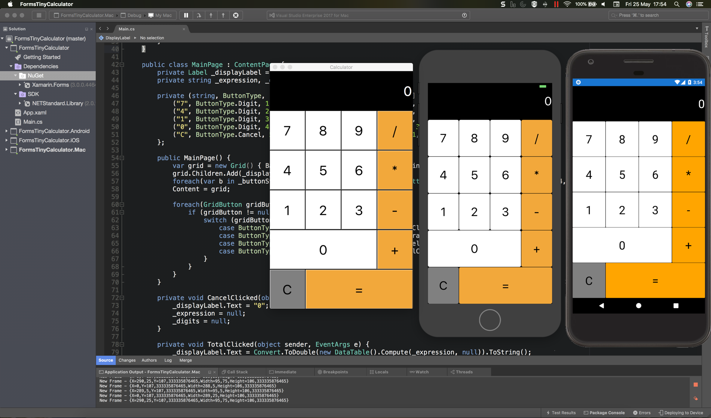
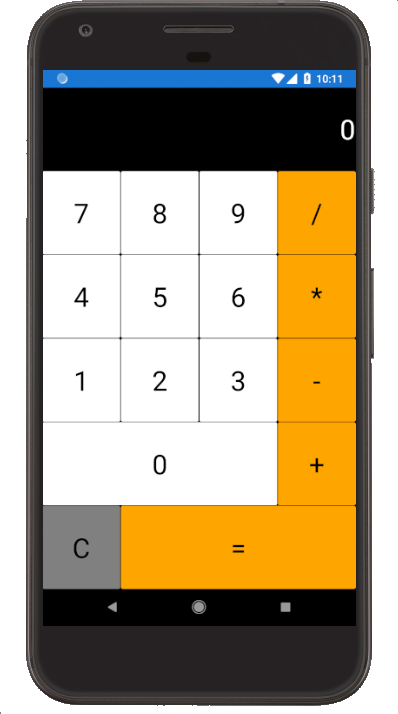
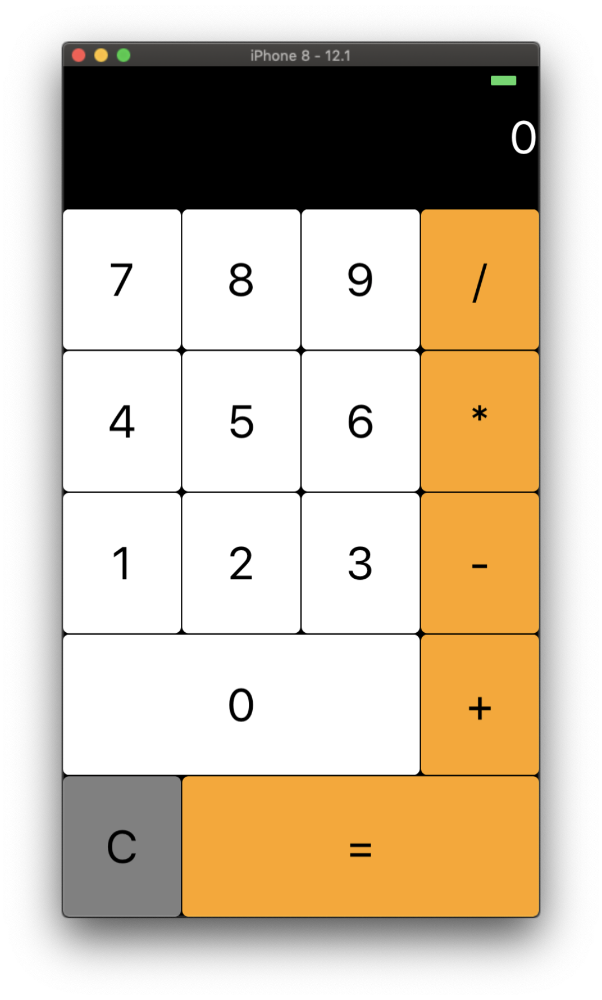
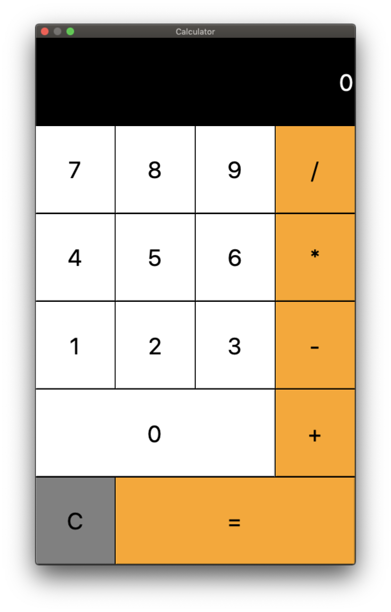
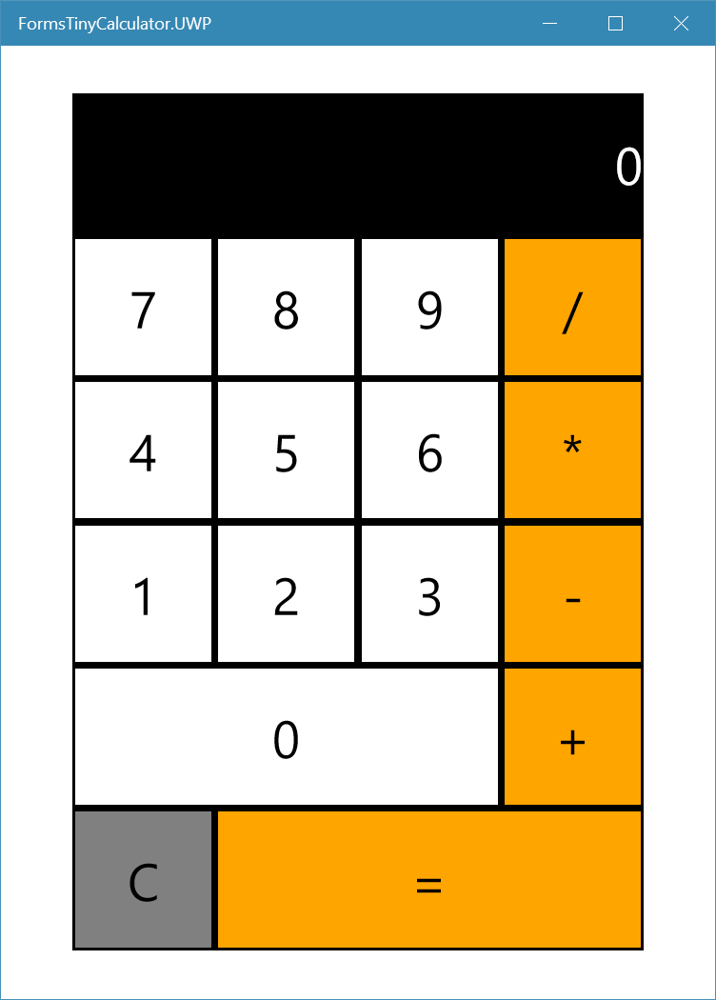
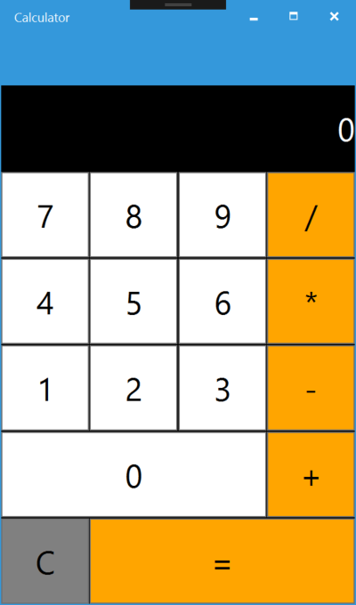
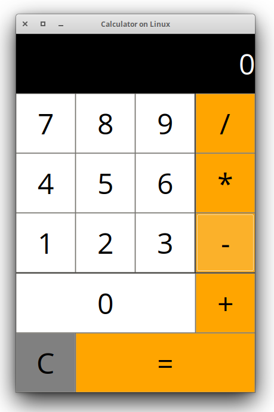
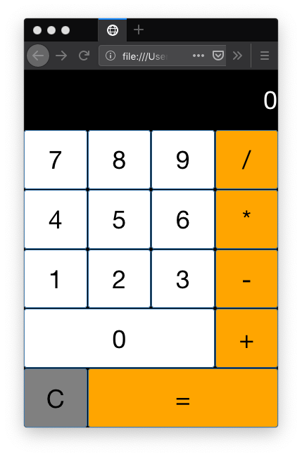

# Xamarin Forms Tiny Calculator
Simple Calculator written using Xamarin Forms (no XAML) in +-90 lines of code.

This project inspired by a tweet by [Don Syme](https://twitter.com/dsyme/status/996720094683258880?lang=en) who managed to create a F# based calculator using Elmish, which runs on top of Xamarin Forms.  His solution weighed in at 95 lines of code.

[Thomas Burkart](https://twitter.com/ThomasBurkhartB/status/997088751724761088) also accepted the challenge for a Flutter equivalent, and his solution weighed in at +-90 lines of code.

This app will run on 7 platforms:

Platform clients:

- Android
- iOS
- Mac
- UWP (Windows Universal Platform, including XBOX)
- WPF (Classic Windows Desktop)
- GTK (for Linux, Mac and Windows)
- WASM (Web Assembly) - Demo Link here:  [https://rogerwcpt.github.io/calculator](https://rogerwcpt.github.io/calculator)

## Code in action on Visual Studio for Mac

## Screenshots for each platform

#### Android

#### iOS

#### Mac OS X

#### Windows UWP 

#### Windows WPF 

#### Linux

#### Web Assembly (browser)

### Notes:

- UI ported from https://github.com/xamarin/mobile-samples/tree/master/LivePlayer/BasicCalculator
- All classes have been crammed into Main.cs to more easily count the lines of code.
- The [MVVM Branch](https://github.com/rogerwcpt/FormTinyCalculator/tree/feature/mvvm) has the ViewModel/View implementation, complete with bindings.
- Braces add more lines of code, so I've used trailing braces for more compact code).
- With the Exception of the WASM project, no third party libraries used, just what is available in Xamarin.  WASM uses [Ooui](https://github.com/praeclarum/Ooui)
- To run the WASM project, build it, then open a terminal at to FormsTinyCalculator.Wasm/bin/Debug/netcoreapp2.1/dist and run `python server.py` to start a lightweight python web server in this folder.  and then open your browser at http://localhost:8000/ . If you have Firefox, you can simply open the index.html file from the same folder without having to start the python web server.

